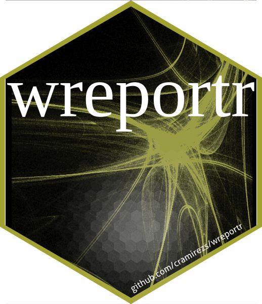

<!-- README.md is generated from README.Rmd. Please edit that file -->

```{r, include = FALSE}
knitr::opts_chunk$set(
  collapse = TRUE,
  comment = "#>",
  fig.path = "man/figures/README-",
  out.width = "100%"
)
```

# wreportr 

<!-- badges: start -->
[](https://www.tidyverse.org/lifecycle/#maturing)
[](https://www.repostatus.org/#wip)
[](https://github.com/cramirezs/wreportr/actions)
<!-- badges: end -->

The goal of wreportr is to make a summary of your pipeline easier.

The cenral concept is having a set of "steps" your analysis follows,

but it is not limited to a sequential design.

## Installation

You can install the developing version of wreportr from
[GitHub](https://github.com/cramirezs/wreportr) with:

```{r, eval = FALSE}
devtools::install_github("cramirezs/wreportr", ref = "main")
```

```{r setup, include = FALSE}
print_yaml <- function(filename) {
  cat("```yaml", readLines(filename), "```", sep = "\n")
}
```

## Examples

There are several [ways](vignette/) of generating your HTML report,
but the input essentially looks like this:

```{r echo = FALSE, results = "asis"}
print_yaml("/Users/ciro/Documents/liai/scripts/wreportr/vignettes/example1.yaml")
```
